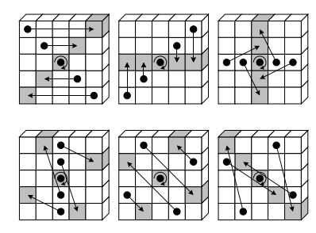

### Uwagi ogólne:


W Keccaku mamy stan.\
Ten stan możemy przedstawić na dwa sposoby w zależności od wygody:
- używając tego sześcianu z obrazka wyżej. Stan oznaczamy jako **A**, a dany bit może być przedstawiony jako **A[x,y,z]**
- używając jednowymiarowego stringa **S**, dany bit to po prostu **S[i]**

Granice:
- x i y zawsze od 0 do 4
- z zawsze od 0 do w-1 (generalnie w SHA-3 zawsze od 0 do 63)
- w podstawowej wersji Keccak, *w* może być ze zbioru:\
  \{1, 2, 4, 8, 16, 32, 64}
- ilość bitów w stanie  (5\*5\*w), w SHA-3 mamy zawsze 5x5x64 = 1600
- stan cały czas ma ściśle określoną długość

Przejście pomiędzy **S** i **A**:\
**A**[ *x*, *y*, *z*]=S[*w* ( *5y* + *x*) + *z*] \

A na chłopski rozum:
dopisujemy do S kolejne bity (klocki):
- zaczynamy od x,y,z = (0,0,0)
- najpierw cała pierwsza lane od z=0 do końca, jak do końca dojdziemy to druga lane od z=0 no i tak do końca plane
- potem przechodzimy o jedną plane wyżej i znowu pierwsza lane, potem druga itd
- i znowu do góry itd i tak aż se przepiszemy wszystkie klocki do S

## Od szczegółu do ogółu:
- mamy 5 bardzo ważnych funkcji: θ,  ρ,  π, χ, ι
- jako argument przyjmują stan i na wyjściu dają zmieniony stan
- tylko ι przyjmuje drugi argument zwany indeksem rundy i<sub>r</sub>
- te funkcje wywołane na stanie jedna po drugiej dają nam funkcję zwaną *f*, główną funkcję Keccaka
- działamy tam na indeksach x,y,z - dla uproszczenia:
  - w prawo: x+1, w lewo: x-1
  - do góry: y+1, w dół: y-1
  - w przód: z+1, w tył: z-1
- wszystkie indeksy x,y,z są mod(dany wymiar), czyli jak na przykład mamy x=-1 a przecież x jest od 0 do 4, to tak naprawdę chodzi nam o x=4
- czyli jak mamy kolumnę na samym prawym brzegu (np x=4, y, z) to kolumna na prawo od niej będzie x=0, y, z
### Theta:
wejście: stan *A* \
wyjście: nowy stan *A'* \
początkowo: A' <- A 


Dla każdego bitu A'(x,y,z) :
1. Z **A** bierzemy kolumny:
   1. jedną na lewo i xorujemy wszystkie bity w niej
   2. jedną na prawo i w tył (tzn z-1) i xorujemy wszystkie bity z niej 
2. Xorujemy to z **A'[x,y,z]**


### Ro:
wejście: stan *A* \
wyjście: nowy stan *A'*
początkowo: A' <- A \

- działamy na lanes
- każdy bit w danej lane przesuwamy w przód o pewną wartość ρ, która zależy od x i y 
  - to znaczy że w danej alejce każdy bit zostanie przesunięty o tę samą wartość bo w alejce x i y się nie zmieniają
- wartość przesunięcia zależy od x i y, poniżej tabelka jakie są przesunięcia dla danego x i y


### Pi:
wejście: stan *A* \
wyjście: nowy stan *A'*
początkowo: A' <- A 

Dla każdego bitu:
- w nowym stanie y bitu staje się takie jak było x bitu
- x bitu staje się takie jak było x+3y bitu
- z pozostaje niezmienne



### Chi:
wejście: stan *A* \
wyjście: nowy stan *A'* \
początkowo: A' <- A \
-> działamy na rows

- A'[x,y,z] <- A[x,y,z] 
- z bitem A'[x,y,z] xorujemy iloczyn (AND) dwóch rzeczy:
  1. bit o 1 na prawo + 1 
  2. bit o 2 na prawo

czyli mamy bit, bierzemy jeden bit na prawo i dodajemy jeden i otrzymujemy jakiś bit, potem bierzemy bit o dwa na prawo
i te dwa bity mnożymy przez siebie i w A' dodajemy do tego co już tam siedziało.

## Iota:
wejście: stan A, numer rundy i<sub>r</sub> \
wyjście: nowy stan A'

Z numeru rundy musimy obliczyć stałą rundy która będzie wykorzystywana w obliczeniach
#### Algorytm rc(t) którego będziemy używać do obliczenia stałej rundy RC:
- jak t mod 255 = 0 to zwracamy 1
- ustawiamy nową zmienną R na 10000000 (nie liczba tylko ciąg bitów)
- lecimy (t mod 255) razy:
  - do R doklejamy 0 z lewej strony
  - do każdego z elementów: 0, 4, 5, 6 dodajemy xor element 8
  - obcinamy R do 8 elementów (odcinamy nadmiarowe bity z prawej, tzn bierzemy 8 najbardziej znaczących bitów)

- numer rundy to zerowy element powstałego R, oznaczamy jako rc

#### Operacje:
RC - lista **w** zer (pamiętamy że w SHA-3 w=64 ale algorytm jest generyczny)
- dla j od 0 do log<sub>2</sub>w ustalamy (np w SHA-3 od 0 do 6):
  - RC[2<sup>j</sup> - 1] = rc(j + 7i) 
- Bierzemy plane na samym spodzie (x=0,y=0), i do każdej alejki z osobna (czyli do listy lewo-prawo)
dodajemy RC bit po bicie


## Runda:
Rnd(A, ir) = iota(chi(pi(rho(theta(A)))), i<sub>r</sub>)

## Funkcja Keccak-p
I teraz funkcja podstawowa Keccak-p[[b, n<sub>r</sub>]](S): 
- b - pojemność stanu (w SHA-3 zawsze 1600)
- nr - liczba rund (w SHA-3 zawsze 24)


- Mamy stringa S
- Przekształcamy go do zmiennej stanu A 
- dla i<sub>r</sub> od 12+2log<sub>2</sub>w-n<sub>r</sub> do 12+2log<sub>2</sub>w 
  - wykonujemy na A Rnd(A, ir)
- Zamieniamy A znowu na stringa i zwracamy

## Funkcja Keccak-f

Keccak-f -  szczególny przypadek Keccak-p

zależność: Keccak-f[b] = Keccak-p[b, 12+2log<sub>2</sub>w]

trochę jaśniej: mamy ustaloną liczbę rund: dla w=1 mamy 12 rund, w=2 14 rund, w=4 16 rund aż do w=64 24 rundy.
czyli ogółem rund jest n<sub>r</sub>

To po co w opisie Keccak-p są takie dziwne indeksy?
To dlatego, żeby rundy Keccak-f i Keccak-p przy tym samym b były kompatybilne.\
Tzn, dla w=8 (czyli 25 * 2^8 = 1600 bitów stanu) mamy ściśle określone 24 rundy w Keccak-f, ale możemy mieć tyle rund w Keccak-p ile chcemy. \
I jak w Keccak-p mamy np 19 rund, to te 19 rund w Keccak-p są ostatnimi 19 rundami Keccak-f.\
A jak w Keccak-p mamy rund 30, czyli więcej, to 24 rundy Keccak-f to są ostatnie 24 rundy Keccak-p (indeksy mamy wtedy ujemne).

I ta kompatybilność np powoduje, że Keccak-p przy długości stanu 1600 i 24 rundach to dokładnie to co Keccak-f przy długości stanu 1600 (narzucone 24 rund)

A po co kompatybilność? \
Bo Keccak-f jest używane do SHA-3 a Keccak-p jest generyczne.
## Gąbka:

- mamy tę naszą funkcję f tzn jota teta itd ileś tam rund, przyjmuje stan i oddaje stan
- mamy zmienną r (długość bloku) mniejszą od b, oraz zmienną c która razem z r daje b (czyli b = r+c)
  - na r mówimy rate, bo tyle bitów jest zaciąganych do gąbki przed każdą f
  - na c mówimy capacity, bo razem z r daje b (czyli długość stanu)
- mamy zmienną d, która mówi ile bitów ma mieć wyjściowy hash
- mamy padding opisany we wcześniejszej części sprawka, tzn:
  - j = (-m-2 mod r) gdzie m to długość wiadomości 
  - do wiadomości doklejamy 1, potem j zer i potem 1
    - padding może się oczywiście rozlać do następnego bloku i jest to ok
    - w paddingu może być 0 zer i to też jest okej
  - padding w SHA-3 wygląda identycznie tylko że przed operacją paddingu doklejamy do wiadomości na końcu 01 (czyli wiadomość będzie o 2 bity dłuższa)
  - wskutek paddingu mamy ciąg bitów którego długość jest wielokrotnością r

## Główny algorytm
No i sklejamy wszystkie puzzle do kupy

- P - wiadomość po paddingu
- n = len(P) / r - czyli n oznacza ilość bloków
- P<sub>0</sub>, P<sub>1</sub>, P<sub>2</sub> ... P<sub>n-1</sub> - kolejne bloki

- ustawiamy stan S na same zera (b zer)
- absorbcja 
  - dla i od 0 do n<sub>r</sub>-1 (tyle razy ile jest bloków)
    - Do bloku P<sub>i</sub> doklejamy c zer (dzięki temu mamy b bitów bo pamiętamy że blok ma długość r) 
      - Oznaczamy to jako P<sub>i</sub> || 0<sup>c</sup>
    - nowy stan  =  f(stary stan + P<sub>i</sub> || 0<sup>c</sup>)
- wyciskanie:
  1. Tworzymy zmienną Z na pusty ciąg bitów
  2. Doklejamy do Z r najbardziej znaczących bitów z S
  3. jeśli otrzymana długość jest co najmniej równa d (długości pożądanego outputu) to zwracamy d najbardziej znaczących bitów z Z
  4. jak nie, to S przepuszczamy przez f i wracamy do drugiego kroku

i teraz tak:
- W SHA-3 mamy zawsze b=1600 i 24 rundy
- SHA-3-224 - r = 448 (c = 1600-448=1152) d = 224
- SHA-3-256 - r = 512 (c = 1088) d = 256
- SHA-3-384 - r = 768 (c = 832 d = 384
- SHA-3-512 - r = 512 (c = 1088) d = 512

## Co zostało zaimplementowane

## Główne rzeczy
- funkcja Theta
- funkcja Rho (przesunięcia obliczane a nie podstawiane)
- funkcja Pi
- funkcja Chi
- funkcja Iota (stałe rundowe obliczane a nie podstawiane)
- funkcja robiąca rundę (złożenie w/w funkcji)
- funkcja paddingująca
- funkcja gąbki (tzn padding + zasysanie + wyciskanie)
- funkcja keccak-p (ta generyczna)
- funkcja keccak-f (szczegolny przypadek keccak-p z tym że liczba rund nie dowolna ale zależy od długości stanu)
- funkcja keccak (szczegolny przypadek keccak-f - długość stanu ustalona na 1600 bitów, a wiec rund 24)
- szczególne przypadki funkcji keccak tzn:
  - SHA3-224 - output 224 bity, c = 448 bitów
  - SHA3-256 - output 256 bitów, c = 512 bitów
  - SHA3-384 - output 384 bitów, c = 768
  - SHA3-512 - output 512 bitów, c = 1024
  - funkcje przyjmują stringi w postaci hex stringa i zwracają hash w postaci hex stringa

## Poboczne rzeczy
- dla przedstawienia wyników: 
  - funkcja zamieniająca string hex na listę pojedynczych bitów
  - funkcja zamieniająca listę pojedynczych bitów na string hex

## wyniki:
Dla stringa i funkcji sha3_256:
```python
m1 = b"krys".hex()
h1 = get_hash(m1, sha3_256)
print(h1)
```
otrzymujemy:
```
14896893efee07c90b08b1f4c0c4d8e32f8414414c0027f80b0a261b59f2de95
```

Zmieniamy wiadomość na krxs: (wiadomość różni się od tej pierwszej tylko jednym bitem)
```python
m2 = b"krxs".hex()
h2 = get_hash(m1, sha3_256)
print(h2)
```
otrzymujemy:
```
0cb61545311154f0d1537b79b6b615699c1e69d26c6b377ed86fb507b2c73076
```

widać, że zmieniliśmy tylko jeden bit na wejściu, wpłynęło to lawinowo na cały hash

### Porównanie z narzędziami online
Ogółem:
https://nvlpubs.nist.gov/nistpubs/FIPS/NIST.FIPS.202.pdf
W dodatkach B1, B2 w/w dokumentu jest napisane jak przygotować wiadomość do algorytmu jeśli jest ona byte-aligned (tzn ma długość 8n bitów) (m.in inny padding).\
różne narzędzia online prawdopodobnie się do tego stosują. Dlatego nie należy się spodziewać że to co my otrzymujemy będzie tym samym co dostaniemy używając gotowych bibliotek.
\Dwa stringi dają poniższe hashe w narzędziach online:
```
832bdd820d60d86a55dbb23f9dd73e622c40c68d6e7b4a56cb7cb3708eb9b2c3 # dla stringa "krys"
d523f1ced7a00a059d3935a3a372fa28328ece8abac1106935abfbf366065479 # dla stringa "krxs"
```
##### Czy to źle, że się różni?
No nie do końca. To nie oznacza, że implementacja jest zła.
Po prostu nie zostały zaimplementowane te funkcje które przekształcają wiadomość zgodnie z FIPS 202.
(dużo zachodu z tym a i też po co, to nie jest celem projektu) \
Ale my mamy algorytm Keccak, który jest generyczny więc nawet tego nie musimy robić.

